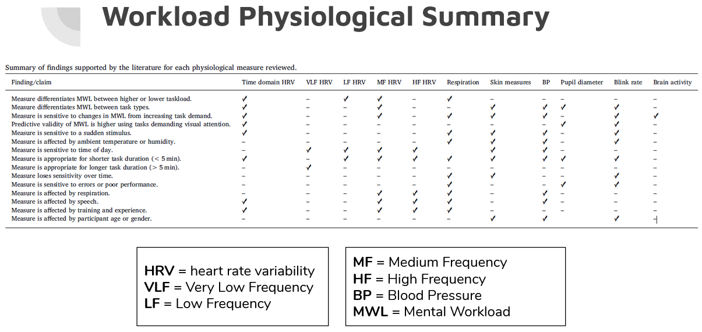

<link rel="stylesheet" href="styles.css" type="text/css">

<link rel="stylesheet" href="https://cdnjs.cloudflare.com/ajax/libs/font-awesome/4.7.0/css/font-awesome.min.css">

---

### *CAVE Development Blog*

---

  <a class="btn btn-primary" data-toggle="collapse" href="#09-23-20" role="button" aria-expanded="false" aria-controls="collapseExample">
    Blog Update 09/23/20 - I-Motions
  </a>

  

---

## I-Motions Meeting
  
upon completion of a demo of the i-motions software suite, I think it is a good idea to utilize this service. I am however, in the process of viewing a competitor's work but will need some time to determine if the competitor has a good enough product to compete with i-motions. 

One major issue with the i-motions suite however, is that they do not have full VR support out of the box for UE4 VR environments. We only really loose the object tracking and fixation effects from this which is secondary in my opinion to the pupil dilation and blink rate per my  earlier entry on workload and eye tracking. 

I anticipate that we will want this feature eventually though so some transference of data will likely have to happen where we pipe raw data into i-motions one way or another. 

Below is the system requirements recommended for i-motions. It is unclear if we will need to run the simulation enviornment on the same computer as i-motions but we should expect to have to do so. That said, based on the lowest performance we should still be good with an i-9 VR computer system ... probably ... 

 

### System requirements for i-motions:

| System Performance     	| Low                                                                     	| Medium                  	| High                             	|   	|
|------------------------	|-------------------------------------------------------------------------	|-------------------------	|----------------------------------	|---	|
| CPU                    	| Intel i7 Generation                                                     	| Intel i7 Generation     	| Intel i7 Generation 7 and up     	|   	|
| RAM                    	| 8 GB                                                                    	| 16GB                    	| 32 GB                            	|   	|
| Hard Drive (SSD only)  	| 128 GB                                                                  	| 512 GB                  	| 1 TB                             	|   	|
| Graphics card          	| Nvidia 9 series 2-4GB                                                   	| Nvidia 10 series 4-6GB  	| Nvidia 10 series 6-8GB or higher 	|   	|
| Operating System       	| Windows 10                                                              	|                         	|                                  	|   	|
|                        	| Note:   Apple, windows dual boot, and windows emulators not supported.  	|                         	|                                  	|   	|
| Monitor                	| Resolution: 1920x1080 is the best supported resolution.                 	|                         	|                                  	|   	|
|                        	| Size:   Dependent on eye tracker, typically 22-25” monitor.             	|                         	|                                  	|   	|
|                        	| 2   Monitors required for dual screen.                                  	|                         	|                                  	|   	|

 

### Networking

One disappointing feature of i-motions is that they don't support networking so all the physiological elements have to run off a single computer. Now this isn't clear if it will create an issue with our architecture for the sim since we can still tap into the i-motions API service to make close to real-time decisions as needed but, it might strain whatever computer is running i-motions, the sensors, and the simulation. 

I still think they are the place to go but I may find this coming back to bite me later on...

 

### Varjio HMD - VR

So ... the varjio HMD seems quite robust and has its own unique approach to eye trakcing. Certianly this seems like somethign we may want to get our hands on in some regard. I think for now we can stick with what we have but down the line it might be a good idea for us to persue this kind of HMD since it will have a higher resolotuion and seems to offload some of the work to the HMD more than the Vive does .... still it is uncertain if it is truly superior without having some time to play with it a bit and test it with our system. 

At present, I think the vive is good enough but the IR-eye trackers in the Varjio make it pertty enticing. 

----

  

  <a class="btn btn-primary" data-toggle="collapse" href="#08-18-20" role="button" aria-expanded="false" aria-controls="collapseExample">
    Blog Update 09/18/20 - Eye Tracking & System Recs
  </a>

  

---

## Eye tracking updates and PC system requirements

##### Eye Tracking

I've continued experimentation of the VIVE on my home system and have come to the conclusion that the pre-built free version of the eye tracking plugin is functional but limited and would take a good deal of time and effort to get to work the way we want it to. As such I have two recommendations for paid solutions that come out of the box with data extraction capabilities (or at least seem to claim to) that could significantly expedite the development of the eye tracking in our simulation. At this point, if time and effort is at a priority over cost, I would recommend that we go this route.

###### a) i-Motions

This company claims to have a fully functioning data extraction system that could work in close to real-time as discussed. The demo will determine how much of the case this is and we will see if it is a good fit for our needs.

###### b) Tobii 

Tobii has a paid SDK (plugin) that we could add to our project files that would allow for eye tracking data back and forth but, they actually can't really do what we want with their SDK after chatting with a rep but referred me to cognitive3D which could be of use as an alternative to a manually developed soloution using the Unreal Engine and VIVE's default SDK.

###### c) Cognitieve3D

This company seems small but also promising so I reached out for more information, I'm reviewing their information today and will get more info on their services and offerings later https://cognitive3d.com/ put together for consideration.

---

##### PC Requirements - FPS Issues 

In relation to the PC requirements and the idea of improving our performance, I think Ted's suggestion seems to be aligning with what I can find out if we don't want to wait for newer hardware like the NVIDIA RTX 3090 or similar which honestly seem to have some supply issues currently.

    CPU: Intel i9 10900K

    RAM: 128 GB

    GPU: NVIDIA RTX 2080 Ti

    Storage: 2x 1 TB M.2 ssd, or 1x 2 TB M.2 ssd

I also reached out to my professional network for recommendations and honestly, they are also struggling with the same challenges we are at this level of performance. Seems like there is quite an opportunity to advance the field if anyone can figure out how to parallelize these things effectively and efficiently.

At the current point parallizing the software might yield results where we do some kind of concurrent programming but that is really hard to implement and takes both time, money, and the right expertise.  Apparently, whole languages are starting to emerge that are trying to make this coding easier (google's "GO" language).

With things getting stuck on a single core, the only thing we could do is push the core to its physical limits and overclock it to a bit of an extreme degree (liquid cooling or nitrogen) which is not exactly stable or sustainable as far as I have heard. Barring that we are going to have to start cutting but, we might be able to avoid that if we push for some parallelizing to increase performance. Still, its cutting edge so unstable by nature.

---

  

  <a class="btn btn-primary" data-toggle="collapse" href="#sens_wl" role="button" aria-expanded="false" aria-controls="collapseExample">
    Blog Update 09/08/20 - Sensor Search & Workload
  </a>

  

  
---
 
## Sensor Investigations Workload

Examinign existing research I was able to identify a suite of different sensors for measuring workload. These sensors were fairy robust but some appeared easier to implement than others. Specifically, I saw GSR and Eye tracking as very suitable measurement instruments with little nosie transmission between them. A good paper in Sensors provided me with the following table that I used to make decisions about what I want to pull.

I decided to start with eye tracking since we already have that sensor but have sense foudn additional sensors in the lab, namely, GSR. 

---

  

  <a class="btn btn-primary" data-toggle="collapse" href="#collapseExample" role="button" aria-expanded="false" aria-controls="collapseExample">
    Blog Kick-Off - Project outline
  </a>

  

  
---
 
## Blog Purpose and Project Outline
  
Starting in August of 2020 I joined a team of engineers at the University of Michigan's automotive research center with the goal of integrating human subjects into a autonomous driving simulation platform. This platform was original built as an HiL simulator and is now being expanded for the inclusion of a human subjects branch. My team is currently focusing on three different thrust areas. 

These thrust areas are:

  1. Establish physiological sensors to gather useful data from human subjects related to workload, situational awareness, and similar metrics.
  2. Establish the ability of the human actor to interface with the virtual world via a simulated vehicle cab and VR headset. 
  3. Establish bi-directional communication modalities such as touch, voice, and physical signaling between the virtual agents and the humans in the simulator.
  
The purpose of this html blog is to log my progress on these projects. 

**Presently there is a rough gant chart I'm using to tack things live [here](https://plan.toggl.com/#pp/Hcz3dlYWWxXe7Mrpabq9CsrNtpYrpSkJ)**
  
---
  
      
  

