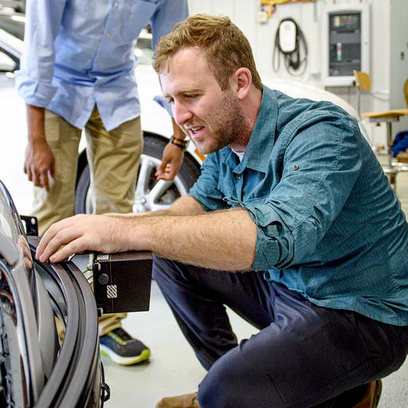

<link rel="stylesheet" href="styles.css" type="text/css">

<link rel="stylesheet" href="https://cdnjs.cloudflare.com/ajax/libs/font-awesome/4.7.0/css/font-awesome.min.css">

I am a current Ph.D. student in the school of information at the University of Michigan. I focus my studies on the relationships between humans and machines. In particular, I study the effect of different team designs and other factors on outcomes such as performance, well-being, trust, and more. 

**My recent work has focused on optimizing human-robot teams (HRTs).**

HRTs combine the benefits of automation such as high accuracy, speed, and repeatability with flexibility, adaptability, and creative problem-solving ability typically associated with humans. My research at the University of Michigan involves the study of such teams, how they come about, how to optimize them, and how to safeguard against their potential negative effects.

---

<button onclick="window.location.href = 'Files/CV.pdf';" class="btn btn-primary"><i class="fa fa-download"></i> Download CV </button>

---

*This Site is Made With Love in R*
